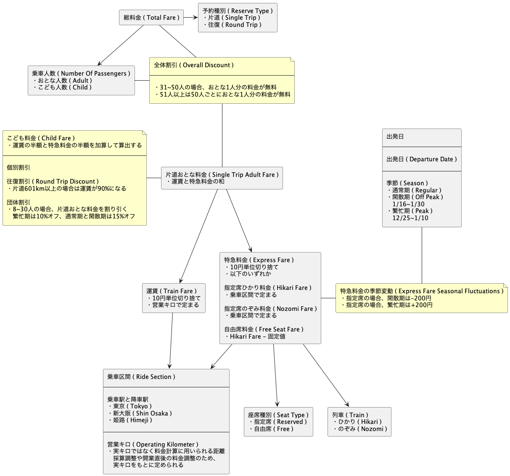
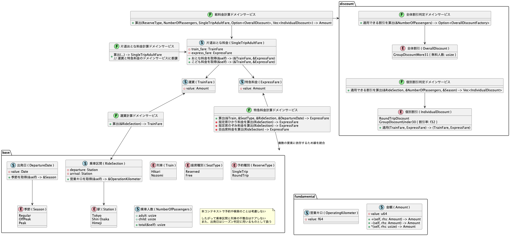

# JR Pricing

https://github.com/masuda220/jr-pricing

## Model

### Concept



### Implementation



## Requirements

```
$ rustup install nightly
```

## Command

### run

```
$ make run

総料金は 153,350,0 円です
```

### lint

```
$ make lint
```

### test

```
$ make test

test result: ok. 103 passed; 0 failed; 0 ignored; 0 measured; 0 filtered out; finished in 0.00s
```

### lint + test

```
$ make fix

test result: ok. 103 passed; 0 failed; 0 ignored; 0 measured; 0 filtered out; finished in 0.00s
```
